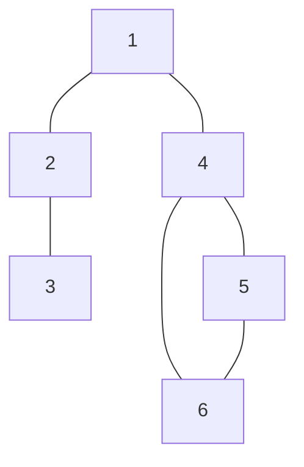
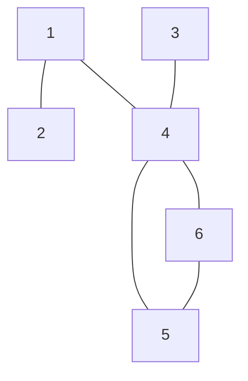
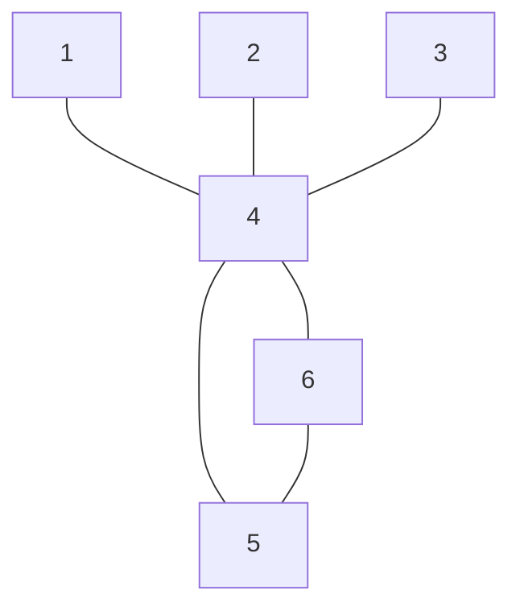
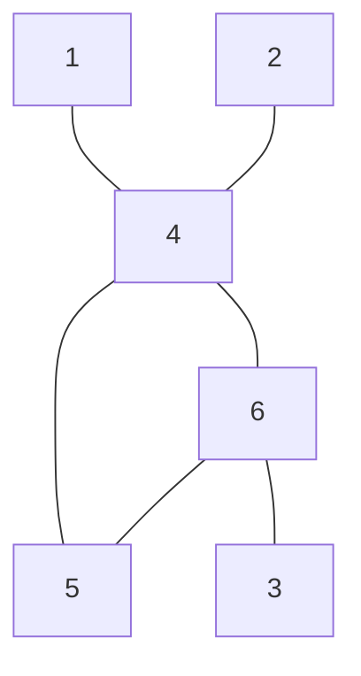
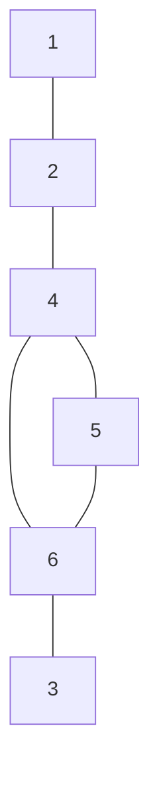
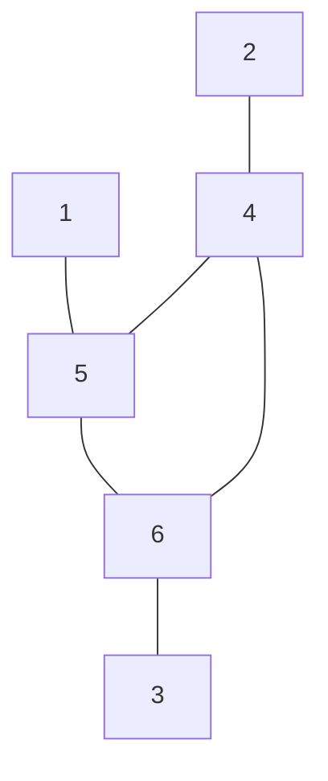
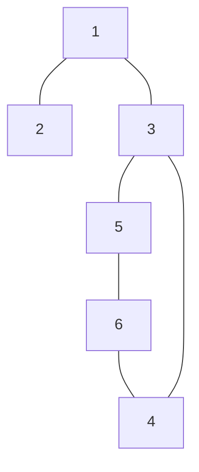
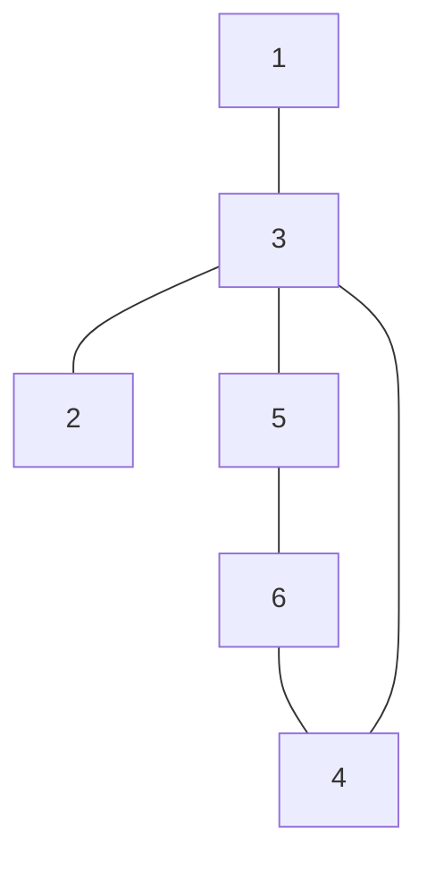
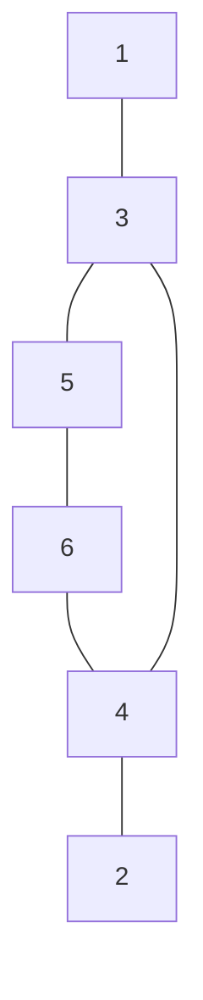
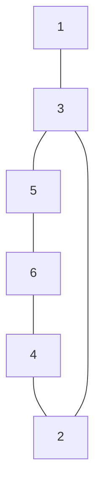

- [ ] https://silverarmpress.com/dungeon-23-my-procedure-for-making-a-megadungeon-sandbox/
- [ ] https://grognardia.blogspot.com/2022/12/dungeon23.html
- [ ] https://www.reddit.com/r/Dungeon23/
- [ ] https://alldeadgenerations.blogspot.com/2021/03/so-you-want-to-build-dungeon.html
- [ ] http://blog.trilemma.com/2014/10/interesting-and-useful-dungeon.html
- [ ] https://goblinpunch.blogspot.com/2016/03/1d135-osr-style-challenges.html
- [ ] https://www.bastionland.com/2018/08/34-good-traps.html
- [ ] https://goblinshenchman.wordpress.com/2022/12/22/puzzle-design-is-it-possible-to-try-to-make-a-more-rigorous-system/
- [ ] https://www.necropraxis.com/2014/12/23/hazard-system-v0-2/
- [ ] https://permacrandam.blogspot.com/2021/02/errant-design-deep-dive-2-core.html
- [ ] https://traversefantasy.blogspot.com/2022/06/fast-travel-watch-keeping-procedure.html
- [ ] https://traversefantasy.blogspot.com/2022/04/cyclical-resource-management.html 
- [ ] https://mindstorm.blot.im/adding-congruency-to-anti-canon-worldbuilding
- [ ] https://mindstorm.blot.im/ladder-tables
- [ ] https://mindstorm.blot.im/nested-monster-hit-dice
- [ ] https://thealexandrian.net/wordpress/48383/roleplaying-games/hexcrawl-addendum-connecting-your-hexes
- [ ] https://silverarmpress.com/the-wilderness-is-a-dungeon-jaquaysing-your-rpg-sandbox-setting/
- [ ] https://campaignwiki.org/hex-describe/

1. Roll for original purpose
2. Roll for current purpose
3. Roll for 2 factions inside of the dungeon or related to the dungeon
	1. Use Faction / Front rules from AW or Stars without Number
4. Populate a rumor table that the players can pull from 
5. Roll for a non-hostile occupant
6. Roll for what happened to make this place into a dungeon
7. Roll for a cataclysm impacting the dungeon
8. Roll for loot in the main treasure room 
	1. The dungeon should suggest multiple goals
9. Include a black door to a fourth cluster of rooms presenting a much higher challenge than the rest of the dungeon that the players to return to later
10. Roll for three 6-room clusters. Do so three times and connect each cluster through inflection points
	1. Roll 1d12 for dungeon cycles to determine what exists between the entrance and the goal
		1. 2 alternate paths with different challenges
		2. 2 keys required to open the lock
			1. Roll 1d6 to determine lock and key. 1-3 locks require the key; 4-6 locks may be bypassed with sufficient skill and/or luck
				1. Literal lock and key
				2. Terrain feature or NPC and key item
				3. Impassible environmental or magical effect and means to dispel
				4. Powerful but potentially passable monster and the means to kill or evade it
				5. Lethal but potentially passable trap and means to disable or evade it
				6. Perilous but potentially passable hazard and means to neutralize or evade it
		3. Hidden less dangerous shortcut and long dangerous path
		4. Foreshadowing loop (which teases the goal from the beginning)
		5. Dangerous short route and less dangerous long route
		6. Short path to the goal on the way to the long path to the key, which loops back to the start
		7. Short path to the goal but a one way barrier forces a long path back to the start to leave
			1. Roll 1d4 for barrier type
				1. Physical or magical barrier that appears behind the characters after passing 
				2. One way path (portal, gate, etc)
				3. One way trap (pit, chute, portal etc)
				4. Very dangerous but potentially passable monster, trap, or hazard appears behind the characters after passing 
		8. Extremely powerful monster patrols the cycle from start to goal and back again
		9. Short path to goal and back. Start location becomes much more dangerous on the way back out
		10. Short path to a false goal (that is a trick) and long path to the true goal
		11. Short path to the goal that contains a lock. Short path from the goal leads to the key
		12. Short path to the goal. Optional reward visible from the goal but a dangerous obstacle or guardian blocks a short path to it. 
	2. Roll again to determine their room distribution. 
		1. Roll 2d6 to determine the 2 entrances. If the result is the same, there is only 1 entrance
		2. Roll to determine the connects: 1d6. 1-3 doorway (on a 1, the doorway is stuck), 4-5 1 turn corridor, 6 is a 2 turn corridor. 
		3. 1d6 and assign (re-rolling dupes) 
			1. monster room without treasure
			2. monster room with treasure
				1. 1d6 x 10 x L coins
				2. 1d6 x 100 x L coins
				3. On a Ld20=20, 1d6 gems / jewelry / art pieces worth 1d4 x 100 coins
				4. On a Ld20=20, 1 spell or magic item
			3. Room with a treasure
				1. 1d6 x 10 x L coins
				2. 1d6 x 100 x L coins
				3. On a Ld20=20, 1d6 gems / jewelry / art pieces worth 1d4 x 100 coins
				4. On a Ld20=20, 1 spell or magic item
			4. The rest of the rooms are empty. Roll 1d6 again to determine which empty room has a trap, trick, or puzzle
				1. Roll for a trap trigger and effect, and a dungeon hazard

Things to generate

https://drive.google.com/file/d/1LmHZBTI317x2_8WBXqqTWwepEtd6EEvL/view

1. Original purpose: http://iceandruin.blogspot.com/2016/11/the-ice-and-ruin-dungeon-maker.html
	1. History of the dungeon: Emitters that send out clues: Evidence of the dungeon and what happened and what is hidden
	2. https://deathtrap-games.blogspot.com/2020/04/1d100-things-to-find-in-buried-ruins.html
	3. https://en.m.wikipedia.org/wiki/Plan_of_Saint_Gall
2. Theme: https://dngngen.makedatanotlore.dev/ 3 themes per level: https://www.bastionland.com/2018/10/three-step-dungeons.html
	1. Introduce concept 1
	2. Introduce concept 2
	3. Challenge involving both concepts with an additional twist, typically with a reward
3. Things to retrieve: Map that suggests multiple goals
4. Factions within **Use Stars without Number for Faction rules**
	1. Monsters that wander: Make a list of 11 monsters
	2. Try factions / fronts from MOTW / APOCALYPSE WORLD (What they want to do, etc)
5. Special shifts that occur within (for the overloaded encounter die)
6. Situation hooks that emanate from the dungeon (at least 3 total: Patronage: NPC requests something; offer: bounty, rumors; confrontation: something from the dungeon leaks out and is encountered) / these can be lies or misleading as to the nature of the situation as well
	1. For curses: what is the curse of the nearby settlement
	2. how is it broken
	3. how to retrieve info
	4. who lives in the village
7. Doomsday: What happens if the heroes do nothing
	1. [Campaign Creation](~%20capture%20notes/processed/OSR%20Notes.md#Campaign%20Creation) Refer to Iymrith the ancient blue sorceress 
8. Restocking: What happens if it is cleared out and what new things take up space
9. 6 room clusters: 
	1. 1 monster room + treasure
	2. 1 monster room
	3. 1 treasure room (hidden treasure)
	4. 3 empty rooms
		1. 1d4 to determine which has a trap
		2. Trap Design: http://angband.oook.cz/steamband/Tricks.pdf, [Traps](~%20capture%20notes/processed/OSR%20Notes.md#Traps)
		3. Puzzles: [Puzzles](~%20capture%20notes/processed/OSR%20Notes.md#Puzzles)
10. one encounter that makes no sense, creature that looks like something that it's not, one disorienting effect (teleporter, swivel surface, maze, gravity, mirrors, etc.); monster that is too powerful but there is a way to avoid them
12. Layout: 1d10 layout per six room cluster: https://i.imgur.com/1dExJvV.png / https://oubliette.bin.sh/
13. Per 3 6 room clusters, 1 black door into a much more difficult 6 room cluster: https://coinsandscrolls.blogspot.com/2017/08/osr-3-level-1-pcs-solve-20-black-doors.html  http://blog.trilemma.com/2017/08/51-black-doors.html
14. Treasure hoard sizes: http://angband.oook.cz/steamband/Treasure.pdf
	1. 1d6 x 10 x L coins
	2. 1d6 x 100 x L coins
	3. On a Ld20=20, 1d6 gems / jewelry / art pieces worth 1d4 x 100 coins
	4. On a Ld20=20, 1 spell or magic item
15. Room types and descriptions: Each room should be visually distinct
	1. murder holes, grates, spy holes, scrying ball, tiny tunnels that connect
	2. Bottlenecks, ledges, fortified positions, bridges, sally ports
	3. Challenges: https://goblinpunch.blogspot.com/2016/03/1d135-osr-style-challenges.html
16. Secret doors: https://goblinpunch.blogspot.com/2018/08/a-comprehensive-guide-to-secret-doors.html

https://lizardmandiaries.blogspot.com/2021/07/generic-room-stocker-part-2-additional.html

 http://dungeon.totalpartykill.ca/

file:///C:/Users/franc/My%20Drive/rpg_resources/00%20Games/02%20OSR/maze%20rats/Maze%20Rats%20V4.3.pdf

# Dungeon Generation Procedure

## 1 What was it and what is it?

Roll once for original purpose of the dungeon. Roll again for current purpose.

1. Prison / Asylum
2. Palace
3. Fortress
4. Temple
5. Museum
6. Workshop
7. Archive / Library
8. Cloister / Monastery
9. Mine
10. Cavern / Sinkhole 
11. Sewer / Canals
12. Tomb / Crypt / Catacombs
13. Maze
14. Observatory
15. Zoo / Greenhouse / Aviary
16. Gargantuan Corpse
17. Vault 
18. House
19. Tower
20. Settlement / Hideout

## 2 What made this a dungeon?

What happened to this location to make it what it is today?

1. Arcane disaster
2. Resource drain
3. Natural disaster
4. Extraplanar disaster
5. Infection / Infestation 
6. Intentional destruction

Complications below can also be added or derive from the origins above to add a ticking clock when needed. These complications can be natural, magical, or caused by a monster. 

1. Collapses / Moving walls and floors
2. Caustics: Lava, acid, fire
3. Infections: Diseases, poisons, vegetation
4. Flooding: Water, sand, non-Newtonian fluids
5. Air quality
6. Magical effects: Planeshifting, magical darkness, wild magic, reverse gravity

## 3 Who lives here?

Find someone to talk to who is not (initially) hostile.

1. Rival adventuring party
2. Ancient denizen (cursed person, ghost)
3. Prisoner
4. Researcher
5. Lost person
6. Sentient object

Populate the dungeon with up to two factions. Create them as follows

First create their impulses:
- Hunters: Victimize vunerable people 
- Feeders: Consume other people's resources
- Enforcers: Tamp down divergence 
- Family: Protect the family and hide secrets 
- Mob: Destroy and scapegoat
- Cult: Victimize and absorb

Populate the dungeon with unique monsters

==TK==

## 4 What can be found here?

There should be multiple goals and sources of loot within a dungeon but focusing on a single major reward will help guide the action and provide incentive for moving through. 

1. Coins, jewels, relics
2. Information, lore, hooks
3. Friendship / ally
4. Trade goods
5. Improved gear, spells
6. Property, favors

## 5 What rumors and hooks emit from this dungeon?

Based on the information gathered so far, create a table of rumors and hooks about this dungeon that could be used to hook players into wanting to explore it. 

For rumors, make a 1d6 table, with 1-3 being truths, 4-5 being partial truths, and 6 being untrue. 

For hooks, make a 1d4 table containing some results in the following categories: 

- Patronage: An NPC requests something 
- Offer: Bounty is available or roll for rumors
- Confrontation: Factions from the dungeon or situations coming out of the dungeon confront the characters directly 

Some may be duplicated for a higher likelihood of occurrence.

You may twist one as well, misleading the characters about one of the following: 
- the situation
- Course of action to do 
- Motives
- Some or all of the above 

## 6 What is the structure of the dungeon?

Roll 1d12 for dungeon cycles to determine what exists between the major reward and the first entrance to the dungeon. 

## Three Step Tool 
1. Concept 1
2. Concept 2
3. Challenge with both concepts

## Secrets

## Dungeon Tricks

## Dungeon Hazards

## Traps

### Triggers

### Effects

## Deadly Element

Add a deadly element. Use it as a black door. 

- Label it as such 
- Provide a manner of escape 

## Something to Experiment With and Expand the World

https://goblinpunch.blogspot.com/2016/01/dungeon-checklist.html

Try a spell table and mess with some effects to get something out of it; include a die roll to randomize where the effect is (or maybe it is the cataclysm effecting the dungeon)

Something unsolved and weird so you can play around with it 

## 6 room clusters

Roll for 3 6 room clusters. They should connect. The first two should have entrances. The first two should have separate challenge themes. The third should connect those two themes. 

1

2

3

4

5

6 

7

8

9

10

## Claim to fame 
1. Person / Entity
2. Environment
3. Object
4. Faction
5. Resource
6. Historical event
7. Recent event
8. Virtue
9. Type of magic
10. Unexplored / unknown

## Descriptors

Randomized descriptors for each dungeon cluster. Three per cluster (take from Maze Rats)

## Black Door 

Roll another room cluster and more rewards. 