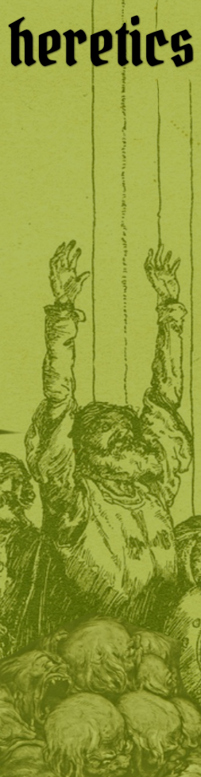

Version 0.5 (initial play testing materials)

Franco A. Alvarado

Published by [Root Devil](https://rootdevil.itch.io/)

## Compatibility 

These rules are intended to be compatible with adventures designed for games like those listed below. B/X modules or modules written to be B/X compatible should work as well. If that is not the case, let me know!

## Ludography

*Heretics* is a cobbled-together game in the folk tradition of homebrew gaming tables with various ideas, mechanics, and philosophies borrowed (looted) from treacherous delves into blogs, forums, chat groups, adventures, and systems. A complete catalogue of those would be impossible due to the nature of memory and due to the litigious natures of certain organizations who don't even like to be mentioned. But those I have remembered are listed below:

- [Arcane Ugly](https://miscastterrain.itch.io/arcaneugly) 
- [Knave](https://www.drivethrurpg.com/product/250888/Knave) 
- [Goblin Laws of Gaming](https://goblinpunch.blogspot.com/2016/05/the-glog.html) 
- [Five Torches Deep](https://www.fivetorchesdeep.com/) 
- [Cairn](https://cairnrpg.com/) 
- [Mausritter](https://mausritter.com/) 
- [Stars Without Number](https://www.drivethrurpg.com/product/230009/stars-without-number-revised-edition-free-version) 
- [Maze Rats](https://questingbeast.itch.io/maze-rats) 
- [Apocalypse World](http://www.apocalypse-world.com/) 
- [Monster of the Week](https://evilhat.com/product/monster-of-the-week/) 
- [DURF](https://emielboven.itch.io/durf) 
- [Ironsworn](https://www.ironswornrpg.com/) 
- [Old School Essentials](https://necroticgnome.com/) 
- [Morkborg](https://morkborg.com/) 
- [Ryuutama](https://kotodama.itch.io/ryuutama-natural-fantasy-roleplay) 
- [The Monsters Know What They're Doing](https://www.themonstersknow.com/) 
- [Principia Apocrypha](https://drive.google.com/file/d/1rN5w4-azTq3Kbn0Yvk9nfqQhwQ1R5by1/view) 
- [Errant](https://www.drivethrurpg.com/product/400164/Errant) 
- [The Alexandrian](https://thealexandrian.net/) 
- [Emmy Allen](http://cavegirlgames.blogspot.com/) 
- [Necropraxis](https://www.necropraxis.com/) 
- [Prismatic Wasteland](https://prismaticwasteland.com/)
- [Traverse Fantasy](https://traversefantasy.blogspot.com/)
- [DIY & Dragons](https://diyanddragons.blogspot.com/)
- [Gus L.](https://alldeadgenerations.blogspot.com/)
- [Telecanter](https://recedingrules.blogspot.com/)
- [Dungeonfruit](https://dungeonfruit.blogspot.com/)
- [Skerples](https://coinsandscrolls.blogspot.com)
- [level2janitor](https://level2janitor.blogspot.com/)
- [Revenant Quill](https://www.revenant-quill.com/)

## License

You may publish free or commercial material based upon and/or declaring compatibility with *Heretics* without express written permission from the creators as long as you adhere to the following terms:

If your product declares compatibility with *Heretics* you must state the following in your legal text and on any websites from which a commercial product is sold: “\[product name\] is an independent production by \[publisher name\] and is not affiliated with the creators of *Heretics*.”

The creators of *Heretics* take no responsibility for any legal claims against your product. 

The mechanics and concepts of *Heretics* may be reused freely because game rules are not protected under copyright, only their expression. 

The text of *Heretics* may not be used verbatim.

Any artists contributing artwork to *Heretics* maintain copyright of their work.

## Colophon

Display font is Pirata One. Body text is Noto Serif. Headings are set in Roboto.

